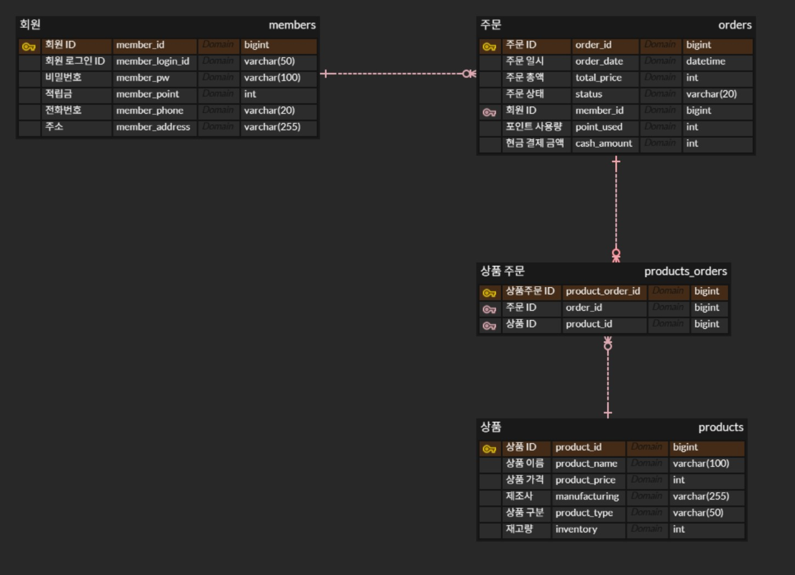
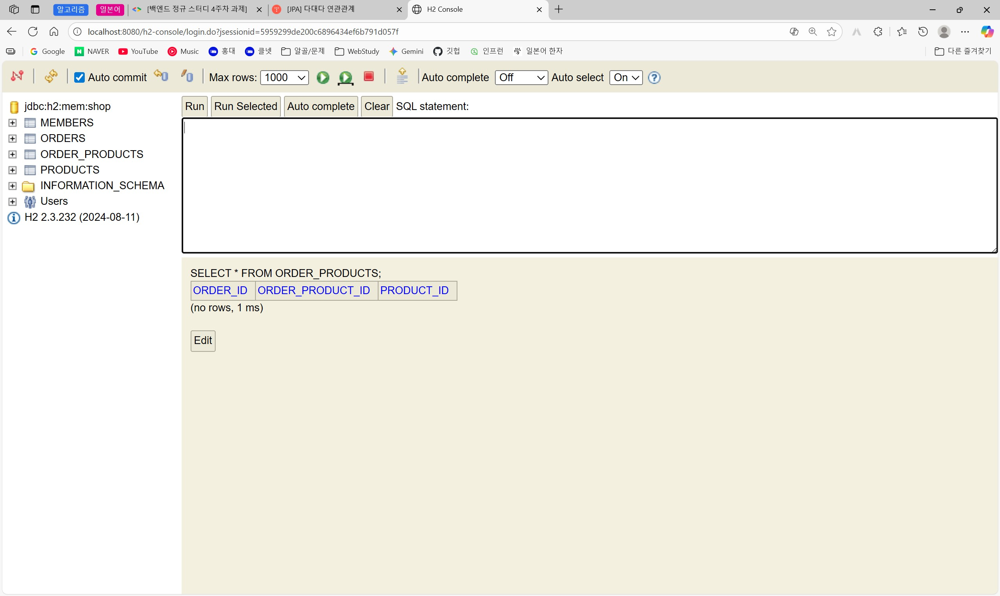
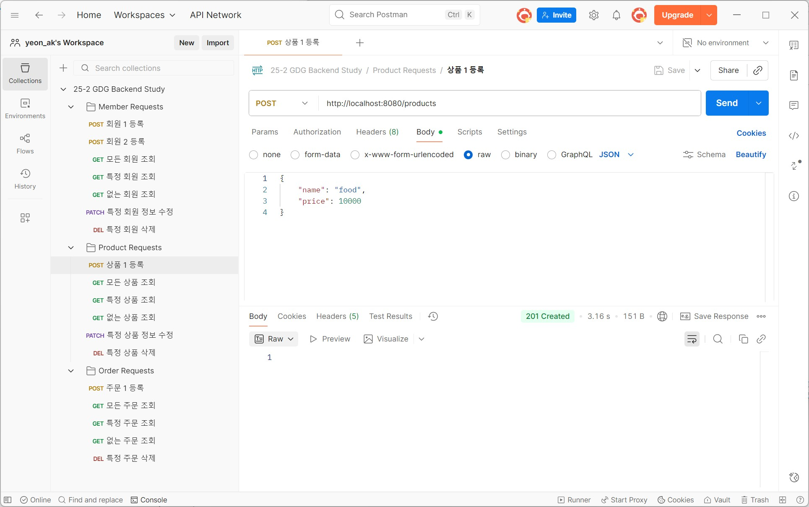
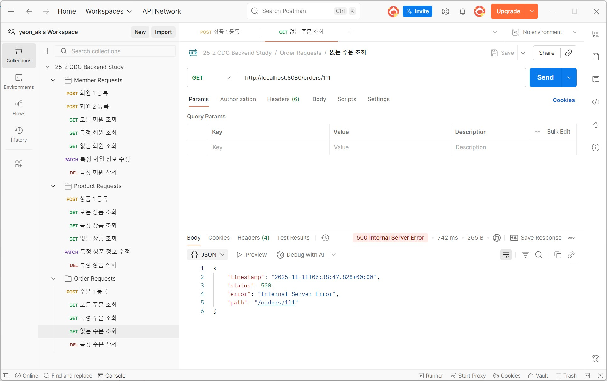

25-2 백엔드 정규 스터디 4주차 Weekly I Learned
===========================================

## 1. ER Model(Entity-Relationship Model)
    개체-관계 중심의 모델링 기법
* Entity(개체): 데이터를 가진 대상  
     + Attribute(속성) (=필드(field), 칼럼(column)): 각 엔티티가 가지는 구체적 정보  
* Relation(관계): 개체 사이의 연관성  
<br>

### ERD(Entity-Relationship Diagram)
    ER Model을 시각적으로 표현한 그림
    - 개발자 간, 클라이언트 간 소통 도구
<br>

* 기본키 (Primary Key): **고유하게 식별**되는 데 사용되는 **하나 이상**의 속성
* 외래키 (Foreign Key): **다른 테이블의 PK를 참조**하는 속성

<br>

### 관계(Relation)의 종류
* 일대일 관계
* 일대다 관계  
    \- 다 쪽이 일 쪽의 기본키를 외래키로 가진다
* 다대다 관계  
    \- 중간 테이블을 만들어 양쪽의 기본키를 외래키로 가져옴

<br>

* 식별 관계: 관계 대상의 PK를 자신의 PK로도 사용
* 비식별 관계: 관계 대상의 PK를 자신의 FK로만 사용

<br>
엔티티 -> 자바와 DB가 소통하는 단위  

엔티티 클래스를 정의 -> JPA가 엔티티 클래스 정의를 참고하여 <u>테이블 생성 SQL문</u>을 작성하고 실행

<br>

## *DB 연결
1. build.gradle 파일 -> dependencies에 추가
```
implementation 'org.springframework.boot:spring-boot-starter-data-jpa'  
runtimeOnly 'com.h2database:h2'
```

2. src.main.resources. application<u>.properties</u> -> .yml  
내용 추가 필요  
```spring:
  application:
    name: shop
  
  datasource:
    url: jdbc:h2:mem:shop;MODE=MYSQL     <- 관리자 콘솔 url(jdbc:h2:mem:shop으로 접속);
                                            H2가 MySQL처럼 동작
  h2:
    console:
      enabled: true    <- 관리자 콘솔 활성화(default: false)
    
  jpa:
    show-sql: true      <- JPA가 생성한 SQL 표시
    properties:
      hibernate:
        format_sql: true                 <- 들여쓰기 적용
        dialect: org.hibernate.dialect.MySQL8Dialect      <- SQL 생성 시 MySQL 8 문법 사용
```
3. 애플리케이션 실행 후 `localhost:8080/h2-console` 접속하여 JDBC URL을 `jdbc:h2:mem:shop`로 고치기

## 2. Entity

### 엔티티 클래스
#### Annotation
> `@Entity`  
> \- 엔티티 명시  
> `@Table(name = )`  
> \- 테이블 명시 및 이름 지정  
> `@Id`  
> \- Id(고유 식별자) 명시  
> `@GeneratedValue(strategy = )`  
> \- 값 자동 생성, 키 값 결정을 DB에게 위임  
> \-- GenerationType.IDENTITY  
> `@Column()`  
> \- 컬럼 명, 컬럼 타입 등 지정  

<br>

### 엔티티 생성자
@getter, @NoArgsConstructor 붙임
#### Annotation
> `@NoArgsConstructor(access = )`  
> \- 인자 없는 생성자 자동 생성 (JPA가 엔티티 사용하기 위해 필요)  
> \-- AccessLevel.PROTECTED  
> JPA는 사용 가능, 외부 사용 차단  

<br>

### 외래키
**엔티티 객체**를 필드로 지정 -> JPA가 알아서 처리
#### Annotation
> `@OneToOne`  
> \- 일대일 관계  
> `@OneToMany(mappedBy = )`  
> \- 일대다 관계  
> `@ManyToOne(fetch = )`  
> \- 다대일 관계  
> `@ManyToMany`  
> \- 다대다 관계  
> `@JoinColumn(name = )`  
> \- FK 컬럼 정보를 명시(name 등)  

> \-- FecthType.LAZY  
> 지연 로딩, 연결된 객체의 정보를 필요할 때 가져옴  
> \-- FecthType.EAGER  
> 즉시 로딩, 본 객체의 정보를 가져올 때 연결된 객체의 모든 정보를 함께 한번에 가져옴  

<br><br>

## 과제: DB ERD 스크린샷


## 과제: H2 테이블 스크린샷


## 과제: API 성공/실패 케이스 테스트 스크린샷

